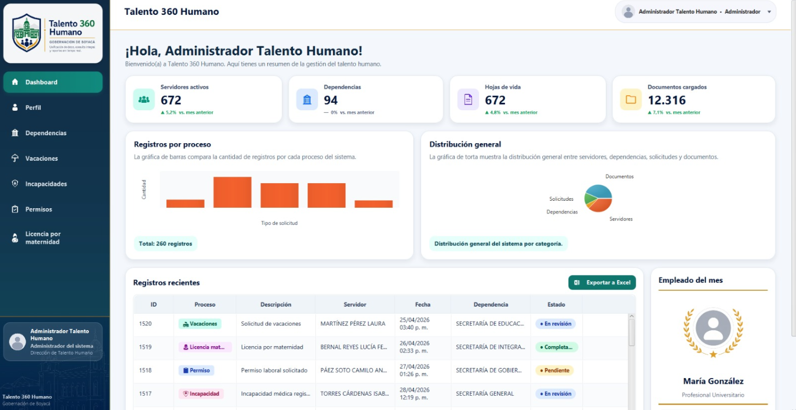
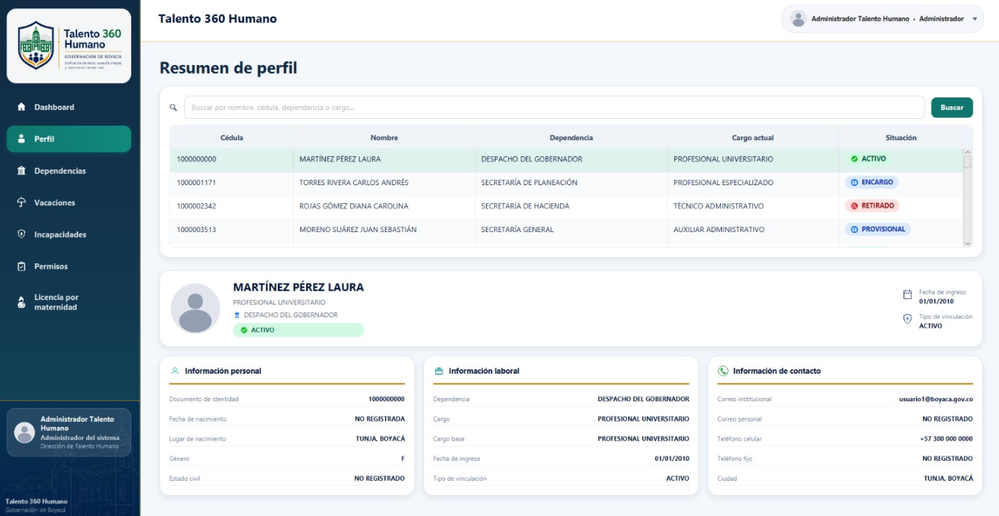
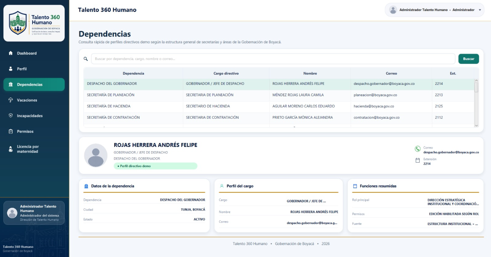
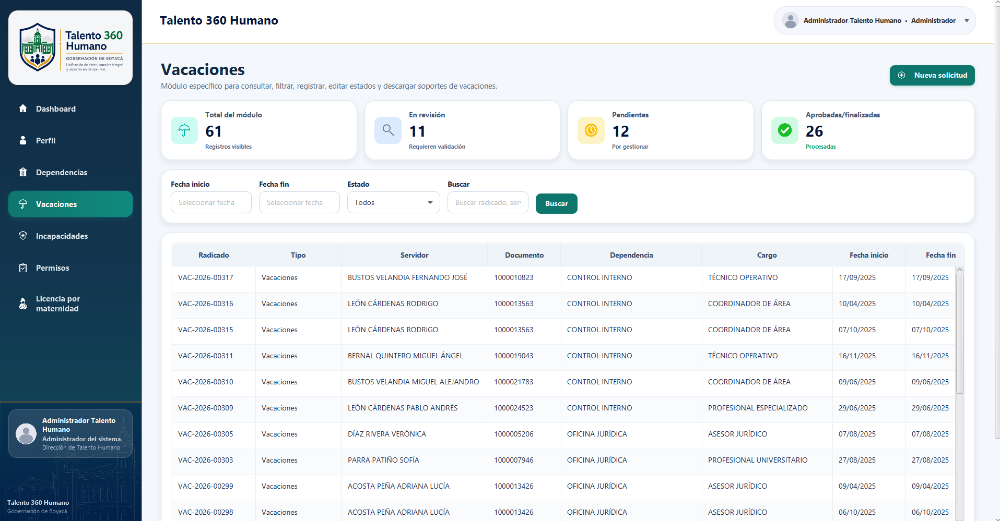
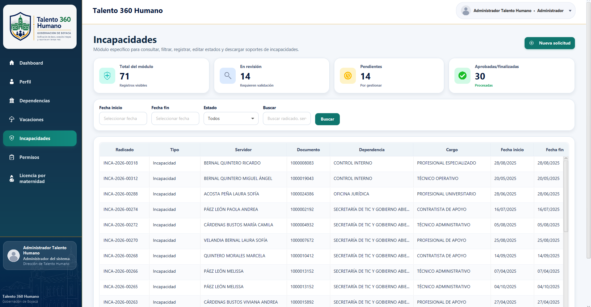
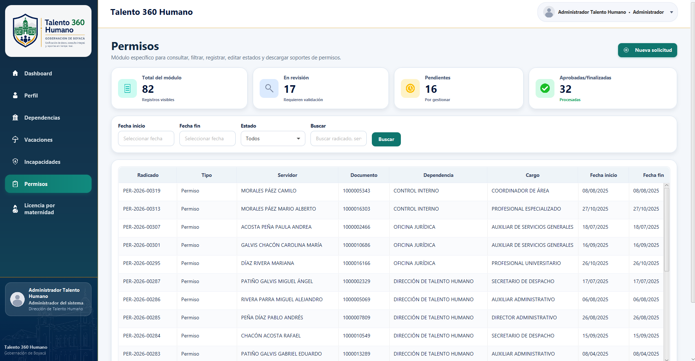
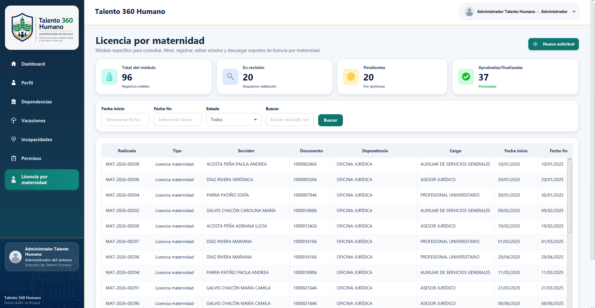

# Talento 360 - Sistema de Gestión de Hojas de Vida

## Descripción general

**Talento 360** es una aplicación de escritorio desarrollada como sistema de gestión de hojas de vida, perfiles de servidores, dependencias y solicitudes administrativas para un entorno institucional inspirado en la **Gobernación de Boyacá**.

El sistema permite consultar, visualizar y administrar información relacionada con servidores públicos, hojas de vida, dependencias y solicitudes como vacaciones, incapacidades, permisos y licencias por maternidad. La aplicación cuenta con una interfaz gráfica desarrollada en **JavaFX** y una base de datos en **PostgreSQL**, permitiendo que los datos no queden únicamente en la interfaz, sino que también se almacenen y actualicen en la base de datos.

---

## Objetivo del proyecto

El objetivo principal del proyecto es construir un sistema de escritorio que permita centralizar y organizar información de talento humano, facilitando la consulta de perfiles, hojas de vida, dependencias y solicitudes administrativas.

El sistema busca simular una herramienta institucional donde los datos puedan ser consultados, registrados y gestionados de manera visual, organizada y estructurada.

---

## Funcionalidades principales

### Dashboard

El dashboard permite visualizar un resumen general del sistema, incluyendo:

- Total de hojas de vida registradas.
- Total de servidores activos.
- Total de dependencias.
- Total de documentos o registros administrativos.
- Tabla de registros recientes.
- Gráfica de barras con información general del sistema.

### Perfil

La sección de perfil permite consultar información de servidores registrados en el sistema, incluyendo:

- Nombre completo.
- Identificación.
- Dependencia.
- Cargo.
- Estado o situación laboral.
- Resumen general del perfil.

### Dependencias

La sección de dependencias permite visualizar las áreas o dependencias registradas, junto con información relacionada a los servidores vinculados.

### Solicitudes administrativas

El sistema permite gestionar diferentes tipos de solicitudes:

- Vacaciones.
- Incapacidades.
- Permisos.
- Licencia por maternidad.

Cada solicitud puede tener diferentes estados, como:

- Pendiente.
- En revisión.
- Aprobada.
- Rechazada.
- Finalizada.

Los cambios realizados desde la interfaz se reflejan en la base de datos, lo que permite que las consultas y registros mantengan consistencia entre la aplicación y PostgreSQL.

---

## Tecnologías utilizadas

| Tecnología | Uso |
|---|---|
| Java | Lenguaje principal del proyecto |
| JavaFX | Desarrollo de la interfaz gráfica |
| PostgreSQL | Motor de base de datos |
| SQL | Creación, consulta y manipulación de datos |
| Maven | Gestión del proyecto y dependencias |
| CSS | Estilos visuales de la interfaz |
| Visual Studio Code | Editor de código utilizado |
| GitHub | Publicación y control de versiones |

---

## Librerías y dependencias principales

El proyecto utiliza Maven para administrar las dependencias necesarias.

Dependencias principales:

- JavaFX Controls
- JavaFX FXML
- PostgreSQL JDBC Driver
- MySQL JDBC Driver
- Maven Compiler Plugin
- JavaFX Maven Plugin

Estas dependencias se encuentran configuradas en el archivo:

```text
pom.xml
```

---

## Motor de base de datos

El proyecto utiliza **PostgreSQL** como motor de base de datos.

Nombre recomendado de la base de datos:

```sql
talento360
```

La base de datos contiene información relacionada con:

- Usuarios del sistema.
- Personas.
- Hojas de vida.
- Dependencias.
- Cargos.
- Estados.
- Solicitudes.
- Vacaciones.
- Incapacidades.
- Permisos.
- Licencias por maternidad.
- Historial de solicitudes.

Los scripts SQL se encuentran en la carpeta:

```text
database/
```

Scripts principales del proyecto:

```text
01_schema.sql
02_load_data.sql
07_base_final_segura_pgadmin.sql
08_nombres_variados_pgadmin.sql
09_base_final_xampp_mysql.sql
```

El script recomendado para cargar la base final es:

```text
07_base_final_segura_pgadmin.sql
```

Después se puede ejecutar:

```text
08_nombres_variados_pgadmin.sql
```

para mejorar la variedad de nombres en los datos de prueba.

Para XAMPP/phpMyAdmin se agregó una versión compatible con MySQL/MariaDB:

```text
09_base_final_xampp_mysql.sql
```

---

## Estructura del proyecto

```text
talento360/
├── database/
│   ├── 01_schema.sql
│   ├── 02_load_data.sql
│   ├── 07_base_final_segura_pgadmin.sql
│   ├── 08_nombres_variados_pgadmin.sql
│   └── 09_base_final_xampp_mysql.sql
│
├── docs/
│   └── screenshots/
│       ├── login.png
│       ├── dashboard.png
│       ├── perfil.png
│       ├── dependencias.png
│       ├── vacaciones.png
│       ├── incapacidades.png
│       ├── permisos.png
│       └── licencia_maternidad.png
│
├── src/
│   └── main/
│       ├── java/
│       │   └── com/
│       │       └── talento360/
│       │           ├── MainApp.java
│       │           ├── config/
│       │           │   └── Database.java
│       │           ├── dao/
│       │           └── model/
│       │
│       └── resources/
│           ├── assets/
│           └── styles/
│
├── pom.xml
├── README.md
└── .gitignore
```

---

## Capturas del proyecto

### Login


### Dashboard



### Perfil



### Dependencias



### Solicitudes - Vacaciones



### Solicitudes - Incapacidades



### Solicitudes - Permisos



### Solicitudes - Licencia por maternidad



---

## Requisitos previos

Antes de ejecutar el proyecto, se recomienda tener instalado:

- Java JDK.
- Maven.
- PostgreSQL.
- pgAdmin.
- Visual Studio Code o un IDE compatible con Java.

---

## Cómo ejecutar el proyecto

### 1. Descargar o clonar el repositorio

Si el proyecto está en GitHub, se puede clonar con:

```bash
git clone https://github.com/usuario/talento360.git
```

Luego entrar a la carpeta del proyecto:

```bash
cd talento360
```

También se puede descargar el repositorio como archivo `.zip` desde GitHub y descomprimirlo.

---

### 2. Crear la base de datos en PostgreSQL

Abrir **pgAdmin** y crear una base de datos llamada:

```sql
talento360
```

Otra opción es crearla con SQL:

```sql
CREATE DATABASE talento360;
```

---

### 3. Ejecutar el script de base de datos

En pgAdmin:

1. Entrar a la base de datos `talento360`.
2. Abrir **Query Tool**.
3. Abrir el archivo:

```text
database/07_base_final_segura_pgadmin.sql
```

4. Copiar todo el contenido.
5. Pegar el contenido en Query Tool.
6. Ejecutar el script con `F5`.

Después, si se desea mejorar la variedad de nombres en los datos falsos, ejecutar también:

```text
database/08_nombres_variados_pgadmin.sql
```

---

### 4. Configurar la conexión a PostgreSQL

Abrir el archivo:

```text
src/main/java/com/talento360/config/Database.java
```

La aplicación usa PostgreSQL por defecto:

```java
jdbc:postgresql://localhost:5432/talento360
```

También se puede cambiar la conexión sin editar código usando estas variables de entorno:

```text
TALENTO360_DB_URL
TALENTO360_DB_USER
TALENTO360_DB_PASSWORD
```

Para XAMPP/MySQL se puede usar una URL como:

```text
jdbc:mysql://localhost:3306/talento360
```


---

### 5. Ejecutar el proyecto

Desde la terminal ubicada en la carpeta raíz del proyecto, ejecutar:

```bash
mvn clean javafx:run
```

También se puede ejecutar desde Visual Studio Code usando las extensiones de Java, siempre que Maven y el JDK estén configurados correctamente.

---

## Usuarios de prueba

El sistema incluye usuarios de prueba para iniciar sesión:

| Usuario | Contraseña | Rol |
|---|---|---|
| admin | admin123 | Administrador |
| carlos | carlos123 | Gestión |
| maria | maria123 | Consulta |

También pueden funcionar los correos completos si están configurados en la base de datos.

---

## Notas importantes

- La aplicación requiere que PostgreSQL esté activo.
- La base de datos debe llamarse `talento360`.
- Los scripts SQL deben ejecutarse antes de abrir la aplicación.
- Los cambios realizados en solicitudes se guardan en la base de datos.
- Las capturas deben ubicarse en `docs/screenshots/` para aparecer en el README.
- Si la aplicación no inicia correctamente, revisa la conexión en `Database.java`.

---

## Posibles errores comunes

### Error de conexión a PostgreSQL

Verificar:

- Que PostgreSQL esté iniciado.
- Que la base de datos `talento360` exista.
- Que usuario y contraseña en `Database.java` sean correctos.
- Que el puerto sea `5432`.

### Maven no se reconoce como comando

Instalar Maven o verificar que esté agregado al PATH del sistema.

---

## Estado del proyecto

Proyecto académico.

La interfaz se encuentra conectada a PostgreSQL y permite consultar, visualizar y actualizar información relacionada con hojas de vida, perfiles, dependencias y solicitudes administrativas.

---
